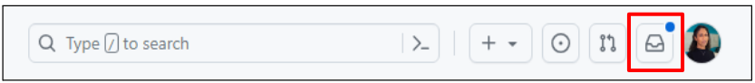
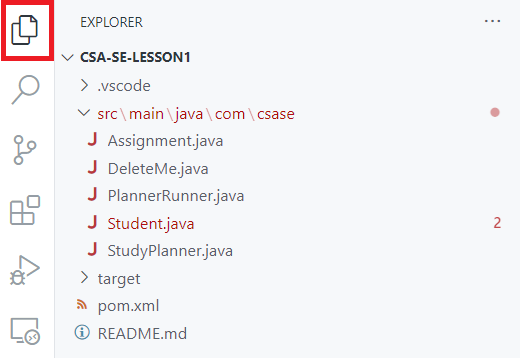

# 👋 Hi! Welcome to GitHub!

Alright, get set for some real **GitHub action**! We're diving into a **scavenger hunt**, where you'll navigate the wilds of **branches** 🌿, uncover the secrets of **commits** 💾, and delve into the mysteries of **pull requests** and **code reviews** 🔍. Whether you're eyeing a career as a software engineer, want to contribute to open-source projects, or just love learning new skills, knowing your way around GitHub is a game-changer.

## Getting Started

1. Click the green **Use this template** button and choose **Create a new repository**.

2. On the **Create a new repository** page, select your GitHub username from the **Owner** dropdown, enter a name for the repository, then click the green **Create repository** button to then create a new repository using the template repository.

3. Go to the **Settings** tab, then navigate to the **Collaborators** option.

4. Click the green **Add People** button, then enter your partner's GitHub username. Click the green button to add your partner as a collaborator on your repository.

5. **Partner B:** Click the **Notifications** button next to your profile picture in the top-right corner of the page.

You should see a notification that you were invited to join your partner's repo. Click the notification, then click the green **Accept invitation** button.

6. From the **Local** tab, copy the HTTPS link.

7. In VS Code, click the **Source Control** tab, then click **Clone Repository**.

8. Paste the link in the command palette that appears. You'll be prompted to choose the location to store the files and whether or not you trust the authors of the folder. Share this link with **Partner B** so they can clone your repository.

9. **Partner B:** Follow Steps 7 and 8 to clone your partner's repository to your computer.

## Part 1: Creating branches

A **repository (aka repo)** is like a project's folder and contains all of the project files and each file's revision history. Repositories can have multiple collaborators and can be either public or private.

A **branch** is a separate line of development. You can use branches to isolate your work when you're developing a new feature or fixing a bug.

Let's start by creating a new branch:

1. Click on the current branch name at the bottom left of the window.

2. **Partner A:** Create a new branch from **main**, then go to the **Source Control** tab and click the **Publish Branch** button to publish your branch to the **origin**.

1. **Partner B:** Create a new branch from **main**, then go to the **Source Control** tab and click the **Publish Branch** button.

> &nbsp;
> **By the way . . .**
> 
> Branch names help your team understand what is being worked on. Consider these best practices when naming your branch:
> * **Keep it short:** Branch names should be concise. Long branch names can be difficult to remember and tedious to type.
> * **Use dashes or underscores:** If your branch name is more than one word, separate words with dashes or underscores for readability.
> * **Use lowercase:** It's best to stick to lowercase, as Git is case-sensitive. Using lowercase can avoid confusion.
> * **Describe the work:** The branch name should give an idea about what the changes involve.
> &nbsp;

## Part 2: Make some changes

Work together on **Partner B**'s computer to make the following changes.

1. Find the `DeleteMe.java` file in the Explorer panel on the left. Right-click the file and select **Delete**.

2. Commit the change by going to the **Source Control** tab, typing `first commit` in the message box, and clicking the **Commit** button.

> &nbsp;
> **By the way . . .**
> 
> A **commit** is an individual change to a file (or set of files).
> 
> Did you see this message after clicking the **Commit** button?
>
> 
> 
> Good! With Git, there are three key states that a file can be in:
> | Modified | Staged | Committed |
> | ---------- | ---------- | ---------- |
> | The file has been changed, but Git is not tracking these changes for the next commit yet. | The changes you made to the file are exactly what you want to include in the next commit. | The version of the file at the moment of the commit has been safely saved in your repo. |
> 
> Before changes can be updated in the repo, they must be added to staging first. If you click **Yes**, you'll continue to be reminded each time you make a commit. If you click **Always**, your changes will always be added to staging automatically before committing them to the repo.
> &nbsp;

3. Go to the repo on GitHub. Can you find your branch?
   **Hint:** Look under the name of the repo on GitHub. You should see a dropdown that says **main** and the number of branches next to the dropdown. Click the dropdown to see if your branch is listed.

4. Back to the code...the `PlannerRunner` class is missing some code! On **Partner A**'s computer, instantiate a `Student` object and call the `getChoice()` method in the `Student` class.
5. There's a syntax error in one of the existing methods in the `Student` class. Find the error and fix it!
6. Run the program. Does it run without errors?
7. Commit your changes using the commit message `fixed Student.java`.
8. After the commit is complete, push your changes by clicking the **Sync Changes** button that appears to update your branch on GitHub.

## Part 3: Stop 🛑 and Reflect 🤔

**Why do you think it's important to create a new branch when making changes to the code, rather than making changes directly in the main branch?**

Write your answer here!

**What does it mean to push your changes, and why is this an important step in using a version control system like Git?**

Write your answer here!

## Part 4: Open a pull request

A **pull request** is a method of submitting contributions to a project. It lets you notify others about changes you've pushed to a repository on GitHub.

1. **Partner B:** Navigate to the repo on GitHub and go to the **Pull requests** tab. Click the **New pull request** button to start a pull request.

> &nbsp;
> **By the way . . .**
> 
> Make sure you're merging to the correct branch! You want **base** to be **Partner A**'s branch, and **compare** to be your branch.
>
> 
> &nbsp;

1. **Partner B:** Provide a title and brief description, and select **Partner A** as the reviewer.
2. **Partner A:** Navigate to the repo on GitHub and go to the **Pull requests** tab. Click the **New pull request** button to start a pull request to merge your branch to **main**.
3. **Partner A:** Provide a title and brief description, and select **Partner B** as the reviewer.

## Part 5: Reviewing the PR

1. Go to the **Pull Requests** tab and select **your partner's** pull request from the list.
2. Click the **Files Changed** tab and go through the changes line by line. For each change, you can click on the line number to add a comment about the line.
3. When you're done reviewing, write a summary comment to give overall feedback about the changes.
   * If you've found issues that need to be addressed, select **Request changes** and submit your review.
   * If everything looks good, select **Approve**. On the **Conversation** tab, click the green button to merge the pull request. Click the **Delete branch** button after the merge is complete.

> &nbsp;
> **By the way . . .**
> 
> It is often recommended to delete the branch after merging. Branches are typically **short-lived** and **topic-specific**, so it isn't needed anymore once the work is merged.
> &nbsp;

## Part 6: Stop 🛑 and Reflect 🤔

**Explain in your own words what a pull request is and why it's useful when collaborating on a codebase.**

Write your answer here!

**How did it feel to receive feedback on your own code? How can you use this feedback to improve your coding skills?**

Write your answer here!
